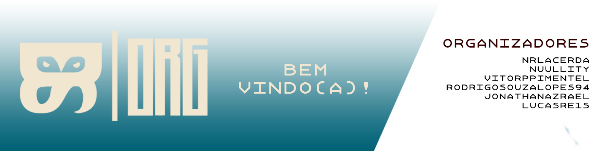

---
# A ORGANIZAÇÃO ⚖️

## Quem somos ? 
Um grupo de estudos de tecnologia no geral, abrangendo desde engenharia mecânica até ciência de dados.

## Qual nosso objetivo ?
Ajudar a distribuir conhecimento entre os membros, trocar experiências e construir coisas juntos.

## Onde estamos ?
Temos servidor no Discord e um grupo no Whatsapp, com aproximadamente 50 membros.

## Quais nossos valores ?
Soberania nacional no âmbito de tecnologia, que educação seja mais acessível a todos.

---

# Projetos 💡

## Atualmente estamos atuando em alguns projetos:
---

### ORGHub - Front 
Frontend do nosso ORGHub, totalmente feito em Angular e utilizando 
arquitetura de Microfrontend, se conectando a outras 
aplicações que podem ser acopladas ao hub.

**Tecnologias: Angular, Typescript, Javascript.**

---

### ORGHub - Gateway
Um gateway que lida com a autenticação, cargos e redirecionamento para as APIs corretas
Utiliza o pattern Factory para lidar com as diversas API`s.

**Tecnologias: C#, .NET, EF, MongoDB.**

---

### ORGHub - Back (Diversos)
Os back`s do ORGHub são distribuidos e são feitos em diversas tecnologias e com
propósitos variados.

**Tecnologias: Java, Spring, EF, MongoDB.**

---
### Bot de Discord (ainda sem nome)
Ainda em desenvolvimento.

**Tecnologias: Javascript, Discord.js**

---

